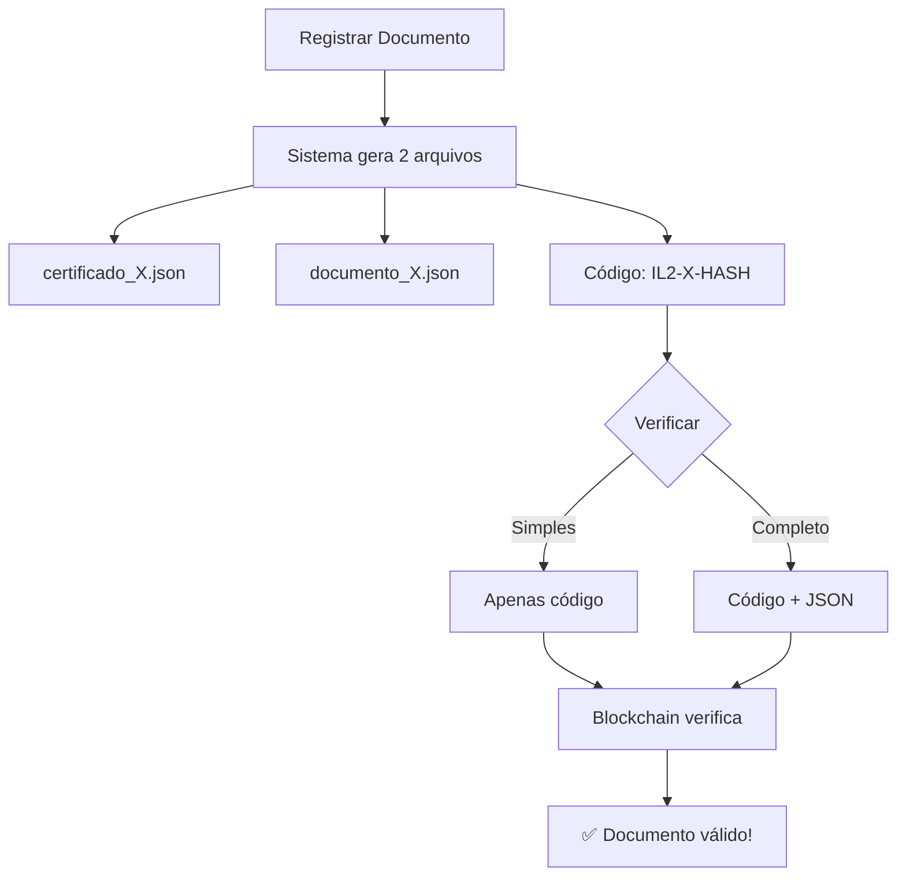

# 📘 Como Usar o Sistema - SBR Prime Blockchain

## 🎯 Respondendo Sua Pergunta

### Preciso preencher o campo "Documento Original (JSON)"?

**❌ NÃO É OBRIGATÓRIO!** O campo JSON agora é **OPCIONAL**.

### Por quê?

Quando você registra um documento, o sistema **salva automaticamente** 2 arquivos:

1. **📁 `certificados/certificado_{serial}_{timestamp}.json`** - Certificado completo
2. **📁 `documentos_originais/documento_{serial}_{timestamp}.json`** - JSON original ✨

---

## 📋 Como Verificar um Documento

### Opção 1: Apenas com Código (RECOMENDADO) ⭐

1. Abra http://localhost:3000
2. Vá para a aba "Verificação por Certificado"
3. Digite apenas o **código de verificação** (ex: `IL2-9-5C318D90`)
4. Deixe o campo JSON **em branco**
5. Clique em "Verificar Documento"

✅ **Resultado:** O sistema busca automaticamente na blockchain!

### Opção 2: Com Código + JSON (Mais detalhado)

Se você quiser validar o conteúdo também:

1. Abra o arquivo `documentos_originais/documento_{serial}_{timestamp}.json`
2. Copie todo o conteúdo
3. Cole no campo "Documento Original (JSON)"
4. Clique em "Verificar Documento"

✅ **Resultado:** O sistema verifica na blockchain E compara o hash do JSON!

---

## 📂 Onde Estão Meus Arquivos?

Após registrar um documento, encontre seus arquivos aqui:

```
js-interlockledger-rest-client/
├── certificados/
│   └── certificado_9_1763754168113.json  ← Certificado completo
│
└── documentos_originais/
    └── documento_9_1763754168113.json    ← JSON original 🎯
```

---

## 🔍 Exemplo Prático

### 1. Registrar Documento

```bash
node teste_arquivos.js
```

**Saída:**
```
✅ Registro concluído!
🔐 Certificado: certificados/certificado_9_1763754168113.json
📄 Documento: documentos_originais/documento_9_1763754168113.json
🎫 Código: IL2-9-5C318D90
```

### 2. Verificar (Método Simples)

No portal web:
```
Código de Verificação: IL2-9-5C318D90
Documento Original (JSON): [deixe em branco]
```

Clique em "Verificar Documento" ✅

### 3. Verificar (Método Completo)

**a) Abra o arquivo JSON:**
```bash
notepad documentos_originais/documento_9_1763754168113.json
```

**b) Copie o conteúdo:**
```json
{
  "tipo": "TESTE_ARQUIVOS",
  "titulo": "Teste de Salvamento de Arquivos",
  "descricao": "Verificando se JSON original...",
  "timestamp": "2025-11-21T19:42:42.812Z",
  ...
}
```

**c) No portal web:**
```
Código de Verificação: IL2-9-5C318D90
Documento Original (JSON): [cole o JSON aqui]
```

Clique em "Verificar Documento" ✅

---

## 💡 Dicas Importantes

### ✅ Boas Práticas

1. **Sempre guarde o código de verificação!**
   - Exemplo: `IL2-9-5C318D90`
   - É a chave para buscar seu documento

2. **Faça backup dos arquivos gerados:**
   - Pasta `certificados/`
   - Pasta `documentos_originais/`

3. **Para verificação simples:**
   - Use apenas o código
   - Mais rápido e prático

4. **Para verificação detalhada:**
   - Use código + JSON
   - Valida também o conteúdo

### ❌ Erros Comuns

**Erro:** "Código de verificação inválido"
- ✅ **Solução:** Use o formato correto `IL2-{SERIAL}-{HASH}`

**Erro:** "JSON inválido"
- ✅ **Solução:** Copie o JSON completo do arquivo salvo
- ✅ **Ou:** Deixe o campo em branco e use apenas o código

**Erro:** "Documento não encontrado"
- ✅ **Solução:** Verifique se o código está correto
- ✅ **Solução:** Aguarde alguns segundos (blockchain pode estar sincronizando)

---

## 🚀 Fluxo Completo



---

## 📞 Resumo Rápido

| O que fazer | Como fazer | Obrigatório? |
|-------------|------------|--------------|
| Registrar documento | `node teste_arquivos.js` | ✅ Sim |
| Guardar código | Copiar `IL2-X-HASH` | ✅ Sim |
| Preencher campo JSON | Copiar de `documentos_originais/` | ❌ Não (opcional) |
| Verificar documento | Código no portal web | ✅ Sim |

---

## ✨ Conclusão

**Resposta Direta:** Você **NÃO precisa** preencher o campo JSON para verificar!

- ✅ Use apenas o código de verificação
- ✅ O JSON é salvo automaticamente para referência futura
- ✅ Preencha o JSON apenas se quiser validação extra

**Sistema está pronto e simplificado!** 🎉

---

**Última atualização:** 21/11/2025  
**Versão:** 2.1.0
